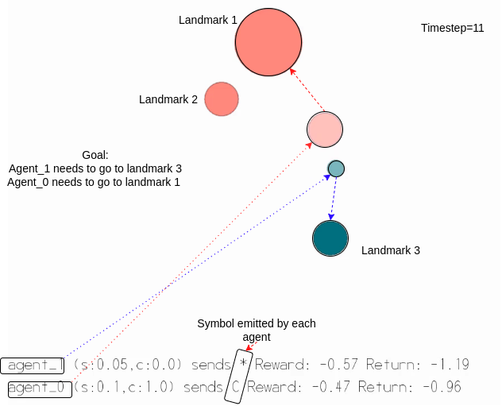
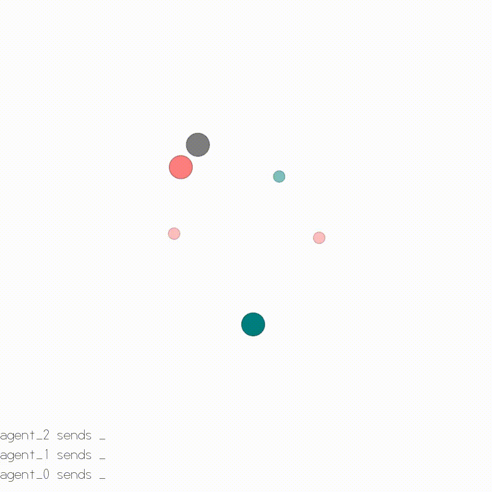
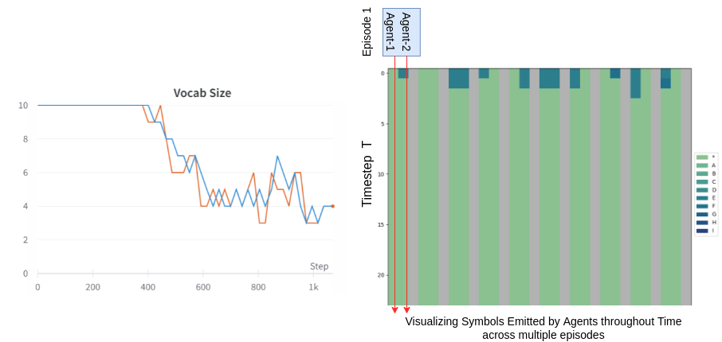
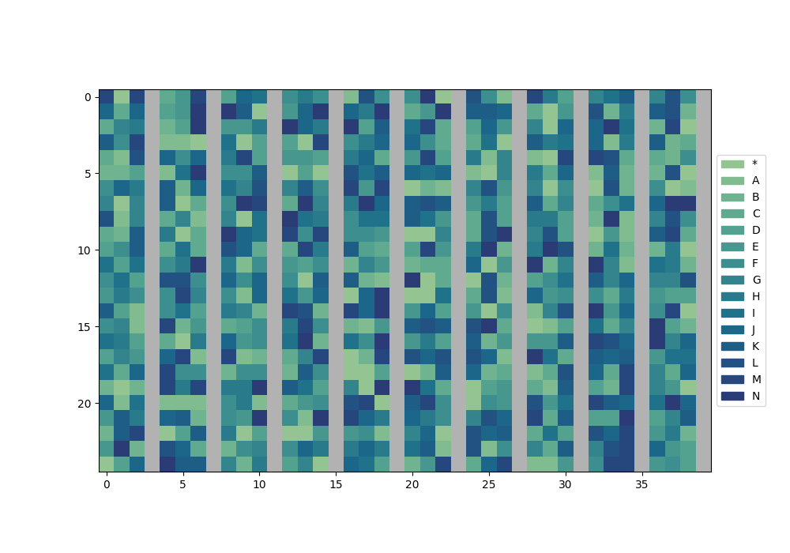
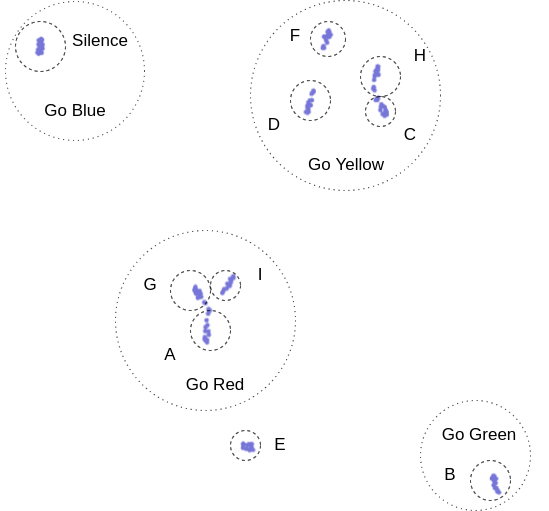
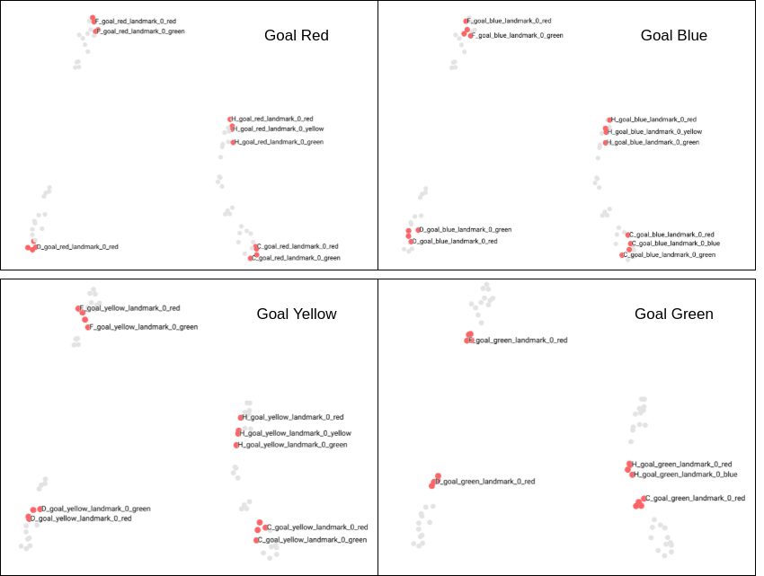
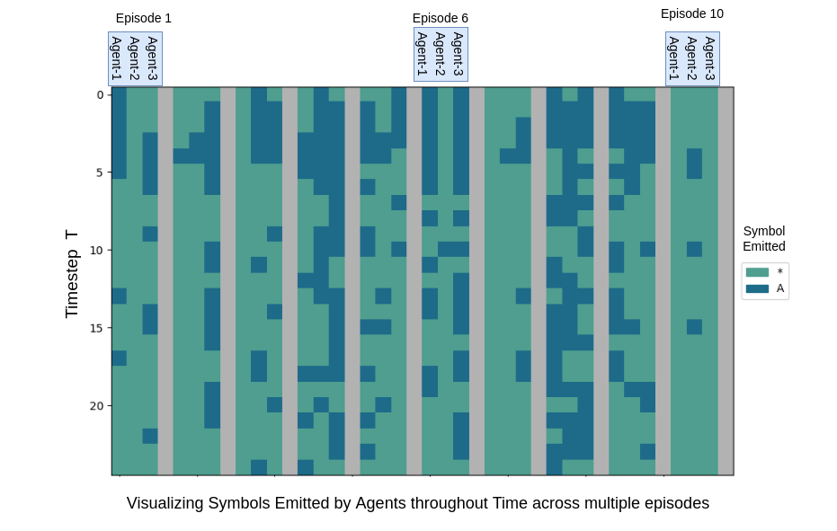
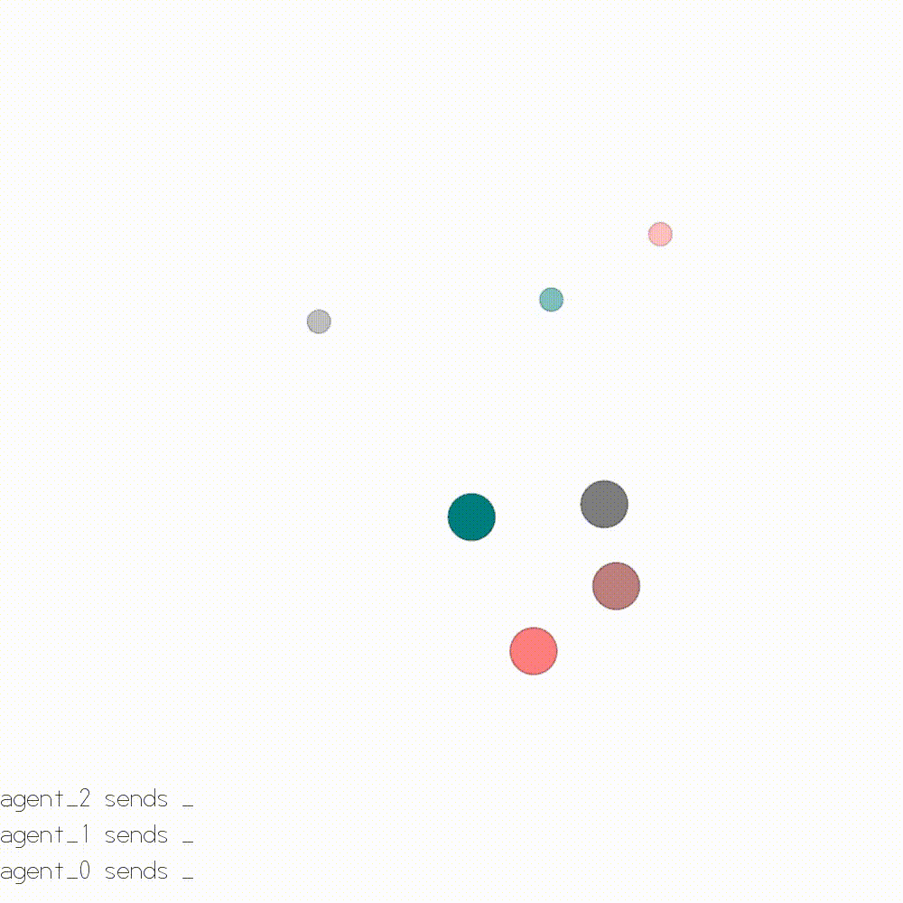

# Language Evolution - The Need to Communicate

## Table of content

- [Introduction](#introduction)
- [Environment](#environment)
- [Results](#results)
- [Exploring the Emergence of Structure in Language](#exploring-the-emergence-of-structure-in-language)
  - [Vocab and symbol emission through time](#vocab-and-symbol-emission-through-time)
  - [Learning of 3 agents with symbols emitted through time](#learning-of-3-agents-with-symbols-emitted-through-time)
  - [Contextual Embeddings](#contextual-embeddings)
  - [Agents invent morse code! - Restraining Vocab Size](#agents-invent-morse-code---restraining-vocab-size)

## Introduction

<!-- The author is Ted Chiange -->
> The only way to learn an unknown language is to interact with a native
> speaker asking questions, holding a conversation that sort of thing
> \[\...\] If you want to learn the aliens' language, someone \[\...\]
> will have to talk with an alien. Recordings alone aren't sufficient.
>
> \- Ted Chiang, Story of Your Life

Have you ever wondered how artificial agents could use language to solve tasks in their environment? In this exciting new study, we delve into the world of utilitarian language understanding, where language is just one of the many tools that an agent can use to accomplish its goals.

For a complete and scientific understanding of my work, please refer to my thesis. [Link to thesis](Thesis.pdf)

But wait, you might be thinking - hasn't the field of natural language processing been focusing on maximizing linguistic objectives using large static datasets? While this approach has certainly led to many advances, it's not enough for building agents that can truly interact with, learn from, and assist humans in the real world. That's where our utilitarian approach comes in - by tying the success of communication to the success of the tasks that the agents are able to solve, we can create agents that can effectively collaborate with humans and even provide insights into human language evolution and cognition.

So, how do we do it? We set up a series of environments based on OpenAI's physics framework and develop algorithms that allow our agents to tackle tasks head-on. But when we try to introduce structure to the language artificially, we end up with results that are quite different from natural language. That's where the power of iterated learning comes in - by simulating the process and the pressures of expressivity naturally, we witness the emergence of compositional and functional natural languages right before our eyes. Our findings suggest that the structure in language emerges naturally as a result of the agents' efforts to solve tasks in their environment.

## Environment

In this environment, agents are interacting with landmarks and obstacles in a simulated 2D space in order to achieve goals. The agents can move in different directions and communicate with each other using a discrete set of symbols. Each agent has an internal goal vector that specifies the landmark it is trying to reach, but **it does not initially know which landmark it is supposed to go to or how to communicate this information to other agents.** The agents must **learn and create their own language** in order to successfully collaborate and solve tasks. The agent's observation state includes information about its own velocity and goal vector, as well as the locations and colors of all the landmarks and agents in the environment. The agents are rewarded for helping other agents reach their landmarks and penalized for communicating with symbols other than silence. The overall reward for all the agents is based on their distance from the landmarks. The main challenge for the agents is **learning how to communicate and navigate to the correct landmarks** without being given explicit instructions.

## Results

We used weights and biases to track our experiments. Here are some of the results we found:

- [Link to W&B Full Table, over 150 experiments!](https://wandb.ai/tgdivy/language_evolution/table?workspace=user-tgdivy)
- [3 Agent success experiment](https://wandb.ai/tgdivy/language_evolution/runs/dltqxste?workspace=user-tgdivy)

<!-- Link to 3 gifs in demo folder next to each-->

Mid Training             |  After Training
:-------------------------:|:-------------------------:
  |  

For more details on the experiments, please refer to my thesis. [Link to thesis](Thesis.pdf) It also includes the model architecture and hyperparameters used for each experiment, as well as multiple agent scenarios and the results of the experiments.

| 3 Agent Scenario | Episode Return | End Reward | Symbols/Episode |
|------------------|----------------|------------|-----------------|
| MADDPG           | -10.6          | -0.12      | 12.6            |
| PPO              | -15.7          | -0.51      | 19.1            |
| PPO + GRU        | -9.6           | -0.08      | 6.8             |
| PPO + GRU + Future Agent State | -8.2           | -0.05      | 4.5             |
| PPO + GRU + Future Agent State + Attention | -9.1            | -0.07      | 7.9             |

## Exploring the Emergence of Structure in Language

We set out with the goal to understand **language and its evolution**. We believe that language exists as a by-product of our need to **collaborate**. Therefore, we followed the **utilitarian definition of language** and created an environment suitable to it. We also developed learning algorithms suitable to solve the required tasks in this environment. The agents have clearly developed some form of **communication**, as evidenced by them succesfully solving the task in the environment. In this section, we further investigate this communication.

### Vocab and symbol emission through time

In this experiment, we observe the relationship between the number of unique tokens (vocab size) and training progress for a pair of agents in an environment with 3 landmarks of 3 different colors. As training progresses, the vocab size gradually decreases from 10 to 4, despite there being no explicit objective to reduce it. Upon investigating the agents' communication, it is discovered that they have developed a holistic language where each symbol has a specific meaning, and some symbols are used as synonyms. In the converged plot of randomly sampled episodes, the agents are observed to only utter one or two symbols to indicate the color of the landmark.

### Learning of 3 agents with symbols emitted through time

Here we can see that initially the communication between the agents is extremely noisy, like emitting random words. Overtime they learn to communicate more efficiently and effectively, creating their language!

### Contextual Embeddings

To better understand the language developed by the agents, we used a technique called contextualized embeddings. We generated these by giving the model artificial input vectors, such as symbols, landmark colors, or goal vectors. We then used t-SNE to visualize the resulting clusters and patterns in the data. We found that the meaning of symbols can change based on the context in which they are used, and that the other agent may be inferring additional meaning from these contextualized symbols. It is possible that the other agent has encoded more meaning than the minimum 4 concepts required for the task.

Word Vector t-SNE              |
:-----------------------------:|
Here we can see through t-SNE how different symbols cluster together to mean different things. Note the labels are based on our observations of the video.                          |
  |

Zoom In Go Yellow Section      |
:-----------------------------:|
When we zoom in we uncover more details hidden in a symbols. Therefore it manages to convey multiple information in single symbol emission. I.e. the goal and the agent referred to!                          |
  |

### Agents invent morse code! - Restraining Vocab Size

In this experiment, we introduce an artificial bottleneck on the maximum number of symbols that the agents can emit. Our hypothesis is that if the vocab size is less than or equal to the number of concepts, then the agents will be forced to combine symbols to form a more complex language that combines these symbols.

In the 3-agent scenario shown, we observe that the agents can form a compositional language, but only with the introduction of this artificial penalty. Based on the videos, the first symbol is used to communicate which agent is being referred to, and the second symbol indicates the desired landmark. The remaining symbols are used to reassure the direction based on the observing agent's position.

Overall, it seems that the formation of compositional language requires an artificial penalty on the number of symbols that can be used.

3 Agent - 2 symbols             |
:-----------------------------:|
Here the agents were only allowed to emit 2 symbols, and we see them still being succesful!                  |
 |

Morse Code example 1             |  Morse Code example 2
:-------------------------:|:-------------------------:
  |  